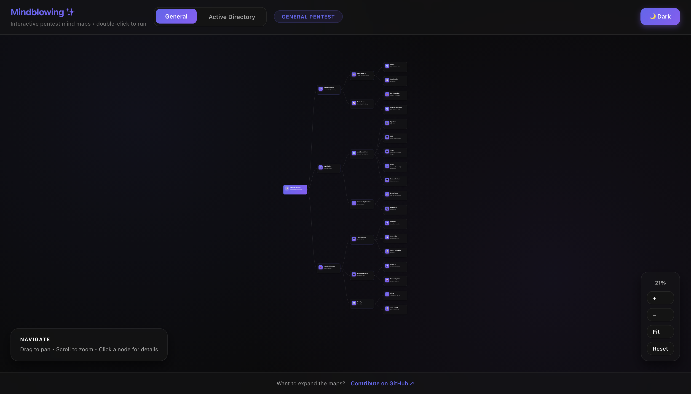

# Mindblowing 🤯

[](https://opensource.org/licenses/MIT)

Interactive pentest mind maps with **zero build steps**.  
Just open the file, explore the map, and copy commands directly from the detail panel.

> **Try it:** download / clone → double-click `index.html`

 

---

## ✨ Highlights

- **Two curated maps**
  - **General Pentest**
  - **Active Directory**
- **Offline-first**
  - No bundler, no server, no npm required
- **Rich node details**
  - Notes, links, and **copyable commands**
- **Smooth navigation**
  - Pan + zoom + Fit/Reset controls
- **Progress tracking**
  - Per-node status (e.g., mark nodes “COMPROMISED”)

---

## 🚀 Quick start

1. Open `index.html` in your browser (**double-click works**).
2. Pick a mode from the top bar (**General Pentest** / **Active Directory**).
3. Click any node to open details and copy commands.

---

## 🕹️ Controls

- **Drag** to pan
- **Scroll** to zoom
- **Click** a node to open its detail panel
- Use the **bottom-right dock** for **Zoom / Fit / Reset**
- Press **Escape** to close the detail panel

---

## 📁 Project structure

```text
mindblowing/
├─ assets           # Folder containing a screenshot 
├─ index.html       # Markup and layout (open this)
├─ style.css        # Styling + theme variables
├─ script.js        # App logic + rendering
├─ general-map.js   # General Pentest mindmap data
└─ ad-map.js        # Active Directory mindmap data